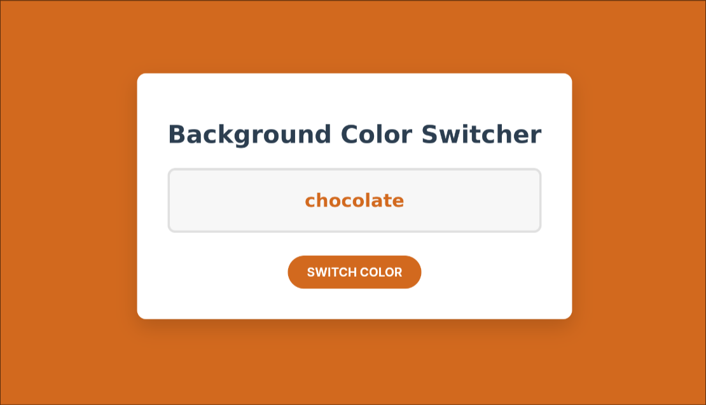

# Vanilla JS Frontend Mini Projects

This repository is a collection of small, focused projects built exclusively using HTML, CSS, and vanilla JavaScript. The core purpose is to practice and reinforce fundamental concepts such as DOM manipulation, event handling, CSS class toggling, and asynchronous actions.

## Project 01: Color Flipper (Completed)

This project demonstrates how to dynamically change the background of the webpage. It is a fundamental exercise in using Math.random() for data selection and manipulating the document.body.style property. It also features linking keyboard events to mouse events using button.click().

Project 02: Simple Modal Window (Planned)

This project will focus on managing element visibility using element.classList.add() and element.classList.remove() to toggle between a hidden and visible state.

## Getting Started

Clone this repository and open any project's index.html file in your browser to run the application locally.
