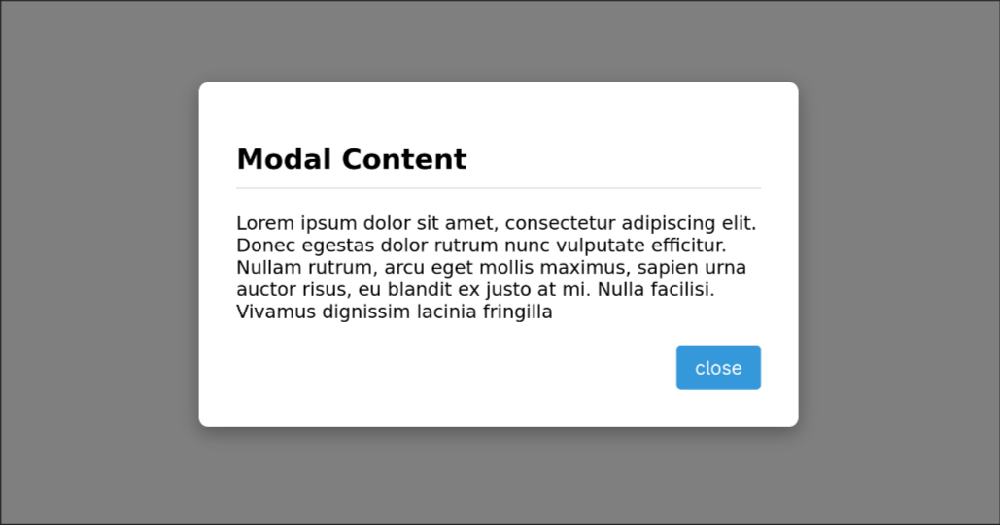
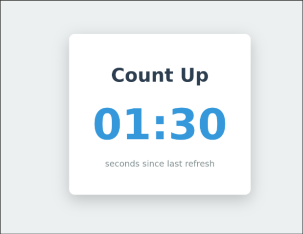

# Vanilla JS Frontend Mini Projects

This repository is a collection of small projects built only using HTML, CSS, and vanilla JavaScript. The point is to strengthen my web dev fundamentals. It's also a nice reference for future projects.

## Project 01: Color Flipper

This mini-project is a simple color flipper. When you press the button the color of the page randomly changes, along with the button color.

## Project 02: Simple Modal Window

This one demonstrates a nice way to control UI visibility by adding and removing the .hidden CSS class. There are also some keyboard shortcuts. Its a good reference for a simple modal window.

## Project 03: Count Up Timer

This one is just a timer that counts up. Starts at zero and counts the seconds up forever. It has simple setInterval() usage and time formatting to make it look nice.

## Getting Started

Just clone this repository and open any project's index.html file in your browser to run the application locally. Or just copy paste the contents, the projects are not that big.
